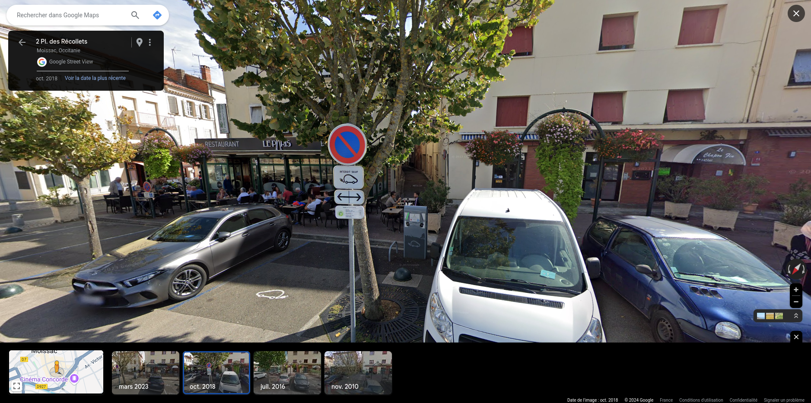
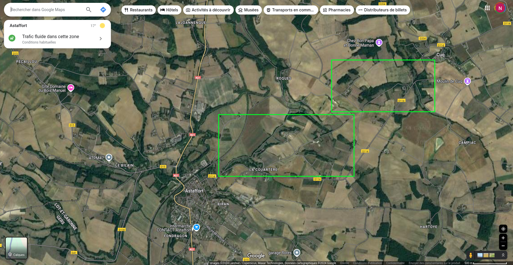
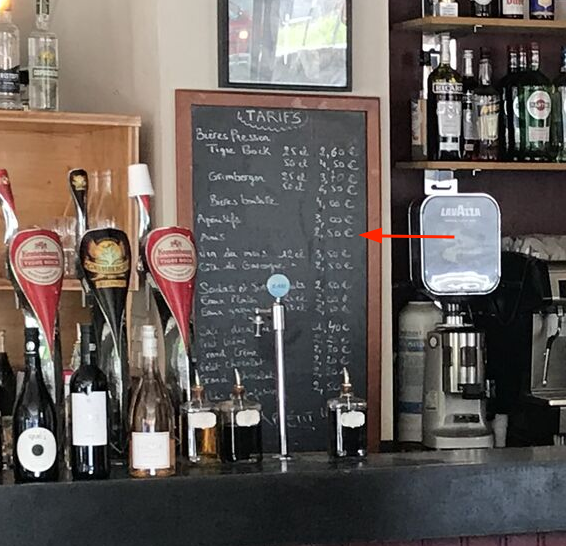

<link rel="stylesheet" href="styles1.css">

# Astaffort Mods AK47 Géolocalisation

[AK47 est le premier album de Astaffort Mods](https://astaffortmods.bandcamp.com/album/ak-47), la réponse française à [Sleaford Mods](https://www.sleafordmods.com/). Je me suis surpris plusieurs fois à vouloir visualiser les lieux évoqués au long de l’album. Faisant mouche lors de ces premières tentatives, j’ai systématisé la démarche. Alors que j’avais abordé AK47 comme une fiction boostée au Casa, il était de se poser une question : et si tout était vrai ? C’est parti pour une enquête visuelle en sources ouvertes.

Avant de commencer quelques précisions :

Nous prendrons tout ce qui est dit dans les textes au premier degré et nous essayons de nous géolocaliser en prenant comme hypothèse qu’Astaffort est le centre du monde.

Je n’ai jamais vécu au sud de la Loire et jamais mis les pieds dans le Lot-et-Garonne. Je ne connais pas la géographie des environs. C’est en partie pourquoi j’ai entrepris ce travail : pour mieux cerner jusqu’où s’étendait l’univers d’Astaffort Mods.

Pour des raisons pratiques, seules les villes et département français cités sont représentés. Désolé pour la Belgique (*le 47*) et Kingston (*Jeunes du dimanche*), vous existez dans nos cœurs. 

Certains lieux ne correspondent pas à une adresse, mais à une zone (ville, département, rocade, canal…), j’ai fait le choix de choisir un point arbitraire pour le représenter (en général la Mairie ou la Préfecture), afin de ne pas surcharger la carte.

Les adresses sont issues de la Base Adresse Nationale. C’est parfois pas hyper précis car certains lieux (le panneau attention chevreuils sur l’A62, le canal de Golfech, mais aussi certaines mairies), ne disposent pas d’adresse normalisée. Pour chacune des localisation, une adresse [What3Words](https://what3words.com) est disponible en description avec une précision à 3 mètres. Moderne.

Dernier truc : ça à l’apparence du sérieux, mais on est d’accord, tout ça c’est pour rigoler, ok ?

# Cartographie des lieux

Pour faciliter la lecture chaque morceau est représenté par un calque qui peut être vu séparément, et une couleur dédiée. En cliquant sur chaque point il est possible d’afficher les informations précises à propos du lieux : 

- Morceau associé et lien Bandcamp
- Texte exact et timecode
- Coordonnées GPS
- Adresse postale
- liens BAN, W3W, Google Street view
- Capture street view
- Lien web le cas échéant

Il s’agit de ma première réalisation avec [Umap](https://umap.openstreetmap.fr/fr/), je vous remercie pour votre indulgence.

# Quelques détails

Pour donner un peu de contexte sur la manière dont certains lieux ont été localisés, vous pouvez vous référer aux info ci-dessous.

## Piqueboufigue

> 
> Le mec est déjà devant toi quand tu te traînes à la boulangerie
>  

Aucune indication plus précise sur la boulangerie fréquentée par Piqueboufigue. Une recherche Google indique 2 établissements, mais on vérifie tout de même sur le registre du commence pour les sociétés enregistrées à Astaffort ayant pour code [APE 10.71C](https://www.insee.fr/fr/statistiques/7929127?sommaire=7763898) : Boulangerie et Boulangerie pâtisserie.

Nous avons 9 résultats à 4 adresses différentes. En vérifiant les dates d’activité, nous avons confirmation que 2 boulangeries étaient ouvertes en 2018, année de sortie de l’album :

1. [Le fournil de l’Abbé](https://le-fournil-de-l-abbe-astaffort.eatbu.com) au 2 rue Félix Cassagneau, proche de la Place de la Craste dont nous reparlerons plus bas.

1. Au fournil gourmand, 7 rue Jacquillon.

> 
> Pour ce conneau, révision de l'alphabet en commençant par la lettre H : Hôpital, deuxième à droite après le pont mais j'ai pas le temps de t'y déposer, d'ailleurs je suis à pieds ce serait trop galère.
>  

le [Centre Hospitalier Agen-Nérac](http://www.ch-agen-nerac.fr/) est l’hôpital le plus proche d’Astaffort. Il se situe à une trentaine de minutes de route, à Nérac. Il est en effet à la deuxième à droite après le Pont Neuf. 

> 
> Même au Musée, devant toi, c'est le même connard.
>  

Cela fait partie des rares endroits que je n’ai réussi à localiser. Vos idées sont les bienvenues.

## Le Shift

3h50 de route aller, voilà un bon shift !

Le road trip égrène 19 références géographiques qui nous permet de suivre plus ou moins précisément le périple du narrateur. On ne va pas tout détailler, vous pouvez vous reporter à la carte. Certains lieux méritent tout de même quelques explications.

> 
> Je me repère avec Golfech
>  

Golfech fait bien sûr référence à la [centrale nucléaire](https://www.edf.fr/centrale-nucleaire-golfech) du même nom, qui se voit de loin. 

> 
> Arrivé à Layrac, je prends le virage
> 

Il y a 2 routes possibles entre Astaffort et Layrac : la Nationale 21 et la Départementale 17. Dans le morceau, l’indicateur suivant est le pont sur l’A62, cela nous laisse deux possibilités, situées à 80 l’une de l’autre :

1- le croisement de la [N21 vers la D17](https://www.google.fr/maps/@44.1313608,0.6602343,3a,75y,48.35h,77.81t/data=!3m8!1e1!3m6!1sOn9f7hkFjM2iBKNgj_xk4Q!2e0!5s20160701T000000!6shttps:%2F%2Fstreetviewpixels-pa.googleapis.com%2Fv1%2Fthumbnail%3Fcb_client%3Dmaps_sv.tactile%26w%3D900%26h%3D600%26pitch%3D12.18620211590978%26panoid%3DOn9f7hkFjM2iBKNgj_xk4Q%26yaw%3D48.352235204324344!7i13312!8i6656?coh=205410&entry=ttu&g_ep=EgoyMDI0MDkzMC4wIKXMDSoASAFQAw%3D%3D) 

2- Le croisement du [chemin de Monseigne et de la D17](https://docs.google.com/spreadsheets/d/10lS1yf_bP--6OAVVYj7203dPf7gajulTC52rwydUO4U/edit?gid=0#gid=0), route peut être plus agréable à emprunter à vélo, et virage plus difficile à négocier quand on est en avance sur son temps.

> 
> J'ai déjà passé le [pont de l’A62](https://www.google.fr/maps/@44.1422694,0.6612244,3a,82.2y,9.25h,79.93t/data=!3m8!1e1!3m6!1sFr7BXtknec1T0nWtybsVng!2e0!5s20181101T000000!6shttps:%2F%2Fstreetviewpixels-pa.googleapis.com%2Fv1%2Fthumbnail%3Fcb_client%3Dmaps_sv.tactile%26w%3D900%26h%3D600%26pitch%3D10.068613154202083%26panoid%3DFr7BXtknec1T0nWtybsVng%26yaw%3D9.249810854799534!7i13312!8i6656?coh=205410&entry=ttu&g_ep=EgoyMDI0MDkzMC4wIKXMDSoASAFQAw%3D%3D)
> 

Attention, il y a les gendarmes !

> 
> Encore plus super quand tu sais qu’on arrive dans un village limité à 50 à 20m d’une zone 30.
>  

L’[entrée du bourg de Laspeyre](https://www.google.fr/maps/@44.1446581,0.7873478,3a,75y,77.69h,77.5t/data=!3m8!1e1!3m6!1sIZMxhq5fNG3-i3AJqn5RIQ!2e0!5s20210301T000000!6shttps:%2F%2Fstreetviewpixels-pa.googleapis.com%2Fv1%2Fthumbnail%3Fcb_client%3Dmaps_sv.tactile%26w%3D900%26h%3D600%26pitch%3D12.5%26panoid%3DIZMxhq5fNG3-i3AJqn5RIQ%26yaw%3D77.69!7i16384!8i8192?coh=205410&entry=ttu&g_ep=EgoyMDI0MTAwMi4xIKXMDSoASAFQAw%3D%3D) correspond à la chanson. Avant d’arriver au village, il y a une longue portion avec une ligne continue et un fossé arboré à droite. Le village est bien sûr limité à 50 et dispose d’une zone 30 ! Problème, le panneau n’est pas visible sur Street View en [2018](https://www.google.fr/maps/@44.1446497,0.787314,3a,75y,77.69h,77.5t/data=!3m8!1e1!3m6!1sPs0bC8cfkgoRHFCiXzVEEg!2e0!5s20181101T000000!6shttps:%2F%2Fstreetviewpixels-pa.googleapis.com%2Fv1%2Fthumbnail%3Fcb_client%3Dmaps_sv.tactile%26w%3D900%26h%3D600%26pitch%3D12.5%26panoid%3DPs0bC8cfkgoRHFCiXzVEEg%26yaw%3D77.69!7i13312!8i6656?coh=205410&entry=ttu&g_ep=EgoyMDI0MTAwMi4xIKXMDSoASAFQAw%3D%3D). Il n’apparaît qu’au passage suivant en 2021. Un doute subsiste donc sur cette localisation.

> 
> Il faut que j’achète une canette de Monster, mais le Proxi il est fermé entre midi et deux.
> 

Le Proxi de Moissac est définitivement fermé. Un Intermarché faisant la journée continue a pris le relais. Moderne !

> 
> Je vais aller boire un café au café de la place
> 

A partir de ce moment, le récit devient plus compliqué à suivre. Je n’ai pas trouvé de café de la place à Moissac. Cependant, il y a [plusieurs places](https://www.google.fr/maps/@44.1034115,1.0859425,3a,75y,142.32h,79.38t/data=!3m8!1e1!3m6!1sRPbmvUAFpoZEodNfCxaqJg!2e0!5s20181001T000000!6shttps:%2F%2Fstreetviewpixels-pa.googleapis.com%2Fv1%2Fthumbnail%3Fcb_client%3Dmaps_sv.tactile%26w%3D900%26h%3D600%26pitch%3D10.617772287423932%26panoid%3DRPbmvUAFpoZEodNfCxaqJg%26yaw%3D142.31828050708964!7i16384!8i8192?coh=205410&entry=ttu&g_ep=EgoyMDI0MTAwMi4xIKXMDSoASAFQAw%3D%3D) avec [des cafés](https://www.google.fr/maps/@44.1050479,1.08479,3a,75y,266.47h,77.96t/data=!3m8!1e1!3m6!1s1y-y7cVmvNcGG4yoc6jDrQ!2e0!5s20181001T000000!6shttps:%2F%2Fstreetviewpixels-pa.googleapis.com%2Fv1%2Fthumbnail%3Fcb_client%3Dmaps_sv.tactile%26w%3D900%26h%3D600%26pitch%3D12.040000000000006%26panoid%3D1y-y7cVmvNcGG4yoc6jDrQ%26yaw%3D266.47!7i16384!8i8192?coh=205410&entry=ttu&g_ep=EgoyMDI0MTAwMi4xIKXMDSoASAFQAw%3D%3D), à proximité du marché et de la mairie. Cette dernière à ma préférence, sans certitude.

> 
> Et y a encore une rivière Pourquoi y a toujours au moins deux rivières dans un département ? Ça sert à rien les rivières, c’est pas moderne, ça existait déjà du temps de Mitterand. D’ailleurs ça c’est un canal, c’est un peu plus moderne et ça sert à rien non plus.
> 

Sur le chemin du retour en passant le canal, on aperçoit à nouveau les réacteurs de Golfech.

## Ville de lumière

> 
> La route est sans surprise. Vinci me pompe en autoroute L’équivalant en ville d’un huitième de casse-croûte
> 

On commence cette virée anxiogène par le péage de l’autoroute E72, gare de péage Toulouse Nord.

> 
> Tu prends Rocade intérieure ou Rocade extérieure ?
>  

Epineuse question que je me garderais bien trancher. J’avoue ne pas avoir tout saisi [aux explications](https://fr.wikipedia.org/wiki/P%C3%A9riph%C3%A9rique_de_Toulouse) sur le périphérique toulousain. Il compte actuellement 2X3 voies actuellement. J’ai lu des choses étonnantes dur des projets d’agrandissement, notamment en le surélevant ? Tu prends rocade Inférieure ou rocade supérieure ?

> 
> Pas v’nu pour un concert de world à la Mounède
> 

Ce bâtiment du XVII° siècle aujourd’hui [centre international de séjour](https://www.lamounede.org/l-historique) a été un lieu de diffusion de musiques actuelle à la fin des années 90 et jusqu’en 2012. On peut retrouver quelques mots sur [l’ambiance et la programmation ici](https://blog.culture31.com/2023/03/11/la-mounede-une-odyssee-extraordinaire-a-toulouse/). Le site web de l’asso qui le gérait est [encore en ligne](http://crpc.free.fr/), optimisé pour Internet Explorer 6 ! Le parc de la [Mounède](https://www.francebleu.fr/emissions/les-mots-d-oc/toulouse/la-mounede-toulouse) semble aujourd’hui héberger un festival de musiques électroniques.

## Champignon

Les chances d’identifier un coin à champignons en restant assis derrière un écran d’ordinateur sont minces, examinons ce que nous avons :

> 
> Hé drôle, tu crois que je t’ai pas vu te garer style en louzedé avec ton putain de Touran 7 places le long du chemin en direction de Cuq ?
> 

La D114 relie Astaffort à Cuq en 4.5km d’une route étroite, avec de longues lignes droites. On y trouve peu de zones boisées et elle est bordée de terres agricoles et de quelques maisons. Pas terrible pour improviser une cueillette. C’est vraiment pas là que je commencerais ma recherche. En plus il y a peu d’endroits pour garer le Touran discrètement. 100% de chances de se faire repérer par les locaux.

Nous n’aurons pas de coin à champignon, mais il reste des choses intéressantes à localiser : 

> 
> Je sais d’où tu viens, Espèce de malin. Je sais même que tu l’a loué chez Europcar, pile en face de la gare.
> 

Avec une plaque 33, on commence les recherches par la gare de Bordeaux. Europcar dispose d’un comptoir aux-côtés d’autres loueurs à l’intérieur de la gare. Pas très satisfaisant. 

Une autre hypothèse pourrait être que le véhicule ait été loué à Agen, dont l’agence Europcar se situe en face de la gare.

> 
> Et c’est pas la peine de te pointer sur les coups de 18h00 au bar du commerce avec l’idée géniale   de nous payer un pastis sans intention d’offrir l’apéro, mais plutôt de nous tirer les vers du nez.
> 

Le bar du commerce est ouvert depuis 2016, en reprise d’activité d’un établissement appelé Au bon accueil. Il est situé au cœur d’Astaffort à proximité immédiates d’autres lieux évoqués : marché, kiosque, Music Halle, boulangerie. Également restaurant, l’établissement recueille de bonne critiques. 

Sur son [site web](https://bar-du-commerce.eatbu.com), on peut apercevoir les tarifs des boissons : 2,5€ l’anis, on peut comprendre que l’apéro se prolonge parfois.

> 
> On lâchera rien, même pas où se trouvent ces putains de toilettes.
> 

A en juger par cette photo de l’intérieur, il est difficile de penser que la localisation des toilettes est une information stratégique. Mais ce n’est peut être pas si évident car on peut noter un changement de signalétique en 2022

## Expectative

> 
> Au Music'Halle, dans une soirée, j’ai vu mixer Xavier
> 

Le Music’Halle est une salle municipale d’une capacité de 576 places ouverte dans les années 1990. Située Place André Routier, cette ancienne halle aux grains construite à la fin du XIX siècle se distingue par sa forme hexagonale. Elle est disponible à la location sur le [site de la Mairie](http://ville-astaffort.fr/page/les-salles-des-fetes).

On trouve de nombreuses captations des rencontres d’Astaffort sur Youtube, avec de probables vues de l’intérieur de la salle, mais je n’ai pas souhaité m’infliger cette peine. Vous découvrirez quelques vues de la scène et des loges sur le [site de la société de production](https://zycopolis.com/les-49emes-rencontres-dastaffort/) ayant réalisé une de ces captations.

## Jeunes du dimanche

> 
> Pour commencer, la maison des jeunes, c'est dans la même direction que le cimetière
> 

Moins de 150m séparent le cimetière de l’ancien abattoir, reconverti en maison des jeunes sous le nom de l’Abattoir (malin). L’[historique complet](https://abattoirastaffort.org/sc-astaffort/2016/11/09/labattoir/) du site, depuis sa création en 1826 est riche de détails. L’activité industrielle d’abattage cesse en 1976, les normes sanitaires évoluant rapidement. Le bâtiment devient atelier municipal avant que le conseil municipal investisse en 1999 pour transformer les anciens abattoirs en maison des jeunes. Plusieurs opérateurs se sont succédés et l’[Abattoir](https://abattoirastaffort.org) est désormais un [bar associatif](https://www.facebook.com/Abattoirastaffort/) ouvert le dernier samedi de chaque mois pour y présenter sa programmation culturelle.

>
> En redescendant la Place de la Craste, j’aperçois le reste de la bande de pignoufs à glander au kiosque
> 

Administrativement, le kiosque se situe place André Routier (maire entre 1925 et 1929), et on peut voir le kiosque depuis la place de la Craste. J’ai relevé des mentions du Music’Halle et du bar du commerce aux 2 endroits. J’ai tout de même un peu de mal à saisir pourquoi on trouve 3 places contiguës dans une si petite zone. 

Pour être complet sur la Place André Routier, elle fait l’objet de [travaux de sécurisation](https://www.sudouest.fr/lot-et-garonne/astaffort/astaffort-un-projet-d-amenagement-des-espaces-publics-du-bourg-17439719.php). J’ai hâte de voir le prochain passage de la Google Car !

> 
> D'ailleurs, ils ont fait un clip de Hip hop avec leur téléphone, et ils ont bien du mérite parce qu'il a fallu faire plus de 30 bornes pour trouver un bâtiment de plus d'un étage. On a reconnu la cage d'escaliers du lycée pro, c'est bien, c'est ghetto,
> 

Sans difficulté, on peut trouver les [4 lycées professionnels](https://college-lycee.com/carte-des-lycees-professionnels/Astaffort-47015#carte) dans un rayon de 30km, à Agen et Lectoure. Le lycée Jean Monnet à Foulayronnes dispose d’un [escalier extérieur spectaculaire](https://lp-jean-monnet.fr/letablissement/) qui pourrait se prêter au décor de notre clip. 

>
> Je me souviens quand on était jeunes, les panneaux avec le chevreuil venaient à peine d'être posés sur l'A 62
> 

Celui-ci n’a pas été le plus simple à localiser. Après avoir parcouru un bon tronçon de l’A62, je n’ai trouvé qu’un panneau avertissant de la présence de chevreuils au niveau de Layrac, donc très proche d’Astaffort. 

## C'est quoi ces conneries

>
> Ici à Astaffort on n’a pas de supermarché, pas de quincaillerie et un très mauvais boulanger, faut se souquer le mercredi pour aller au marché.
>

C’est le morceau problématique de l’album. Astaffort y est dépeint comme une commune dépourvue de tout commerce hormis une boulangerie. En réalité, la commune dispose de plusieurs commerces, comme en atteste le [site de la Mairie](http://ville-astaffort.fr/page/les-entreprises-commerces-et-services-locaux) et la signalétique de la voirie. Il n’y a certes pas de Casto, mais un Brico M et un Point P, *rien que ça*.

Nous avons vu précédemment qu’il existe 2 boulangeries à Astaffort, ce qui est bien pratique pour notre narrateur qui pourra toujours aller acheter son pain dans l’autre !

Enfin, nulle trace de marché le mercredi, mais il y en existe le [lundi](https://www.jours-de-marche.fr/47220-astaffort/) et le [samedi](https://www.petitfute.com/v2353-astaffort-47220/c650-produits-gourmands-vins/c1106-marches-halles/152583-marches.html).

## Denis

> 
> Denis t’es rien qu’un con. Je viendrai plus faire mon contrôle technique chez toi. Je préfère encore me faire chier à aller le faire à Castelculier.
> 

Il existe un garage à Astaffort, mais celui-ci ne propose pas de contrôle technique. En revanche, il est aisé de trouver le centre de Castelcullier.

## CR47

> 
> J'espère qu'il vont pas nous faire jouer sur le stabilisé. Ouais remarque c'est ça ou leur foutu champ en jachère
> 

La ville de Tonneins dispose de plusieurs stades. Si le stade Jean Bernège et sa tribune de 330 places loge les treizistes des [Phoenix de Tonneins](https://www.tonneins13.fr/), on peut jouer au foot sur les 2 terrains de la Plaine des sports ou sur celui du complexe Germillac. Le [site de la mairie](https://www.mairie-tonneins.fr/1/vivre-a-tonneins/sports-et-loisirs/les-installations-sportives) ne mentionne pas de stabilisé mais que des terrains en gazon. La FFF mentionne [3 terrains à la même adresse](https://www.fff.fr/competition/club/518161-tonneins-f-c/information.html), mais je ne comprends pas vraiment où ils les trouvent. Les déplacements pour un match à Tonneins, ça fait une [bonne idée de morceau](https://www.sudouest.fr/sport/football/football-trois-questions-au-coach-de-tonneins-j-espere-que-nous-n-avons-pas-flingue-notre-saison-19082228.php) (l’article est postérieur à la sortie de l’album).

